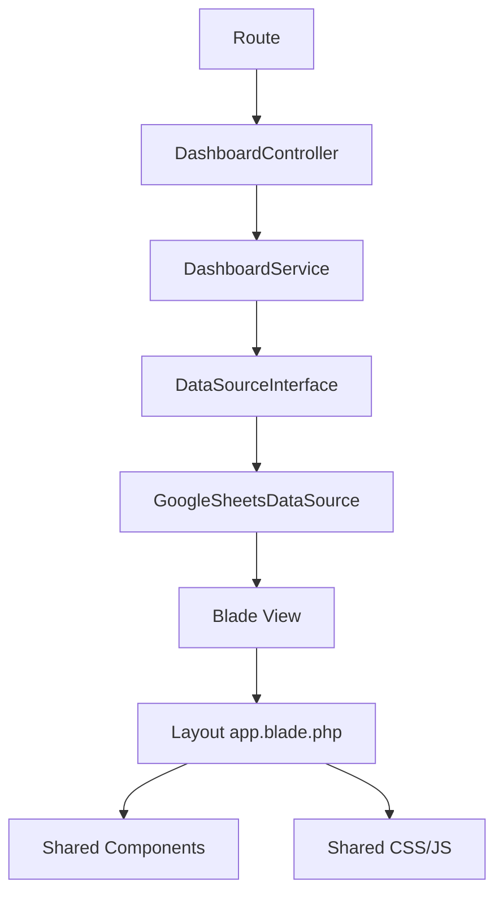

# Dashboard Resource Analysis

## Overview

This document captures the current resource and dependency structure of the six dashboard pages in the Laravel backend project. The analysis is based on the implementation currently present in the repository and is intended to provide context for future UI work, refactors, or AI-assisted changes without requiring a new audit from scratch.

Scope:
- Backend dashboard views under `backend/resources/views/dashboard`
- Shared layout and Blade components
- Controller, service, and data-source layer
- Public CSS/JS assets used by the dashboard stack

## Current State Summary

The six dashboard pages currently share a common request pipeline:

1. Route definition in `backend/routes/web.php`
2. Controller handling in `backend/app/Http/Controllers/DashboardController.php`
3. Business logic and cache handling in `backend/app/Services/DashboardService.php`
4. Data retrieval through `backend/app/DataSources/GoogleSheetsDataSource.php`
5. Blade rendering in `backend/resources/views/dashboard/*.blade.php`
6. Shared shell rendering through `backend/resources/views/layouts/app.blade.php`

This creates a centralized dashboard architecture where the pages are structurally similar, while the page-specific content differs by dashboard type.

## Dashboard Inventory

| Dashboard | Route / entry | Controller method | Primary Blade view | Notes |
| --- | --- | --- | --- | --- |
| Overview | `dashboard.overview` | `overview()` | `backend/resources/views/dashboard/overview.blade.php` | Main executive summary page |
| Biomassa | `dashboard.biomassa` | `biomassa()` | `backend/resources/views/dashboard/biomassa.blade.php` | Biomass-related KPIs |
| Batubara | `dashboard.batubara` | `batubara()` | `backend/resources/views/dashboard/batubara.blade.php` | Coal-related KPIs |
| Solar | `dashboard.solar` | `solar()` | `backend/resources/views/dashboard/solar.blade.php` | Solar usage metrics |
| Stok | `dashboard.stok` | `stok()` | `backend/resources/views/dashboard/stok.blade.php` | Coal stock and HOP |
| Target | `dashboard.target` | `target()` | `backend/resources/views/dashboard/target.blade.php` | Target and cumulative performance |

## Page-to-Resource Mapping

### 1. Overview

Primary view:
- `backend/resources/views/dashboard/overview.blade.php`

Shared shell dependencies:
- `backend/resources/views/layouts/app.blade.php`
- `backend/resources/views/components/breadcrumb.blade.php`
- `backend/resources/views/components/status-bar.blade.php`
- `backend/resources/views/components/kpi-card.blade.php`

Styles:
- `backend/public/css/dashboard.css`
- `backend/public/css/app.css`

Scripts:
- `backend/public/js/overview.js`
- `backend/public/js/dashboard.js`
- `backend/public/js/app.js`

Backend chain:
- Route: `backend/routes/web.php`
- Controller: `backend/app/Http/Controllers/DashboardController.php`
- Service: `backend/app/Services/DashboardService.php`
- Data source: `backend/app/DataSources/GoogleSheetsDataSource.php`

### 2. Biomassa

Primary view:
- `backend/resources/views/dashboard/biomassa.blade.php`

Shared shell dependencies:
- `backend/resources/views/layouts/app.blade.php`
- `backend/resources/views/components/breadcrumb.blade.php`
- `backend/resources/views/components/status-bar.blade.php`
- `backend/resources/views/components/kpi-card.blade.php`

Styles:
- `backend/public/css/dashboard.css`
- `backend/public/css/app.css`

Scripts:
- `backend/public/js/biomassa.js`
- `backend/public/js/dashboard.js`
- `backend/public/js/app.js`

Backend chain:
- Route: `backend/routes/web.php`
- Controller: `backend/app/Http/Controllers/DashboardController.php`
- Service: `backend/app/Services/DashboardService.php`
- Data source: `backend/app/DataSources/GoogleSheetsDataSource.php`

### 3. Batubara

Primary view:
- `backend/resources/views/dashboard/batubara.blade.php`

Shared shell dependencies:
- `backend/resources/views/layouts/app.blade.php`
- `backend/resources/views/components/breadcrumb.blade.php`
- `backend/resources/views/components/status-bar.blade.php`
- `backend/resources/views/components/kpi-card.blade.php`

Styles:
- `backend/public/css/dashboard.css`
- `backend/public/css/app.css`

Scripts:
- `backend/public/js/batubara.js`
- `backend/public/js/dashboard.js`
- `backend/public/js/app.js`

Backend chain:
- Route: `backend/routes/web.php`
- Controller: `backend/app/Http/Controllers/DashboardController.php`
- Service: `backend/app/Services/DashboardService.php`
- Data source: `backend/app/DataSources/GoogleSheetsDataSource.php`

### 4. Solar

Primary view:
- `backend/resources/views/dashboard/solar.blade.php`

Shared shell dependencies:
- `backend/resources/views/layouts/app.blade.php`
- `backend/resources/views/components/breadcrumb.blade.php`
- `backend/resources/views/components/status-bar.blade.php`
- `backend/resources/views/components/kpi-card.blade.php`

Styles:
- `backend/public/css/dashboard.css`
- `backend/public/css/app.css`

Scripts:
- `backend/public/js/solar.js`
- `backend/public/js/dashboard.js`
- `backend/public/js/app.js`

Backend chain:
- Route: `backend/routes/web.php`
- Controller: `backend/app/Http/Controllers/DashboardController.php`
- Service: `backend/app/Services/DashboardService.php`
- Data source: `backend/app/DataSources/GoogleSheetsDataSource.php`

### 5. Stok

Primary view:
- `backend/resources/views/dashboard/stok.blade.php`

Shared shell dependencies:
- `backend/resources/views/layouts/app.blade.php`
- `backend/resources/views/components/breadcrumb.blade.php`
- `backend/resources/views/components/status-bar.blade.php`
- `backend/resources/views/components/kpi-card.blade.php`

Styles:
- `backend/public/css/dashboard.css`
- `backend/public/css/app.css`

Scripts:
- `backend/public/js/stok.js`
- `backend/public/js/dashboard.js`
- `backend/public/js/app.js`

Backend chain:
- Route: `backend/routes/web.php`
- Controller: `backend/app/Http/Controllers/DashboardController.php`
- Service: `backend/app/Services/DashboardService.php`
- Data source: `backend/app/DataSources/GoogleSheetsDataSource.php`

### 6. Target

Primary view:
- `backend/resources/views/dashboard/target.blade.php`

Shared shell dependencies:
- `backend/resources/views/layouts/app.blade.php`
- `backend/resources/views/components/breadcrumb.blade.php`
- `backend/resources/views/components/status-bar.blade.php`
- `backend/resources/views/components/kpi-card.blade.php`

Styles:
- `backend/public/css/dashboard.css`
- `backend/public/css/app.css`

Scripts:
- `backend/public/js/target.js`
- `backend/public/js/dashboard.js`
- `backend/public/js/app.js`

Backend chain:
- Route: `backend/routes/web.php`
- Controller: `backend/app/Http/Controllers/DashboardController.php`
- Service: `backend/app/Services/DashboardService.php`
- Data source: `backend/app/DataSources/GoogleSheetsDataSource.php`

## Shared Resources

The following resources are used across multiple dashboard pages.

### Shared layout and UI shell
- `backend/resources/views/layouts/app.blade.php`
- `backend/resources/views/components/navbar.blade.php`
- `backend/resources/views/components/sidebar.blade.php`
- `backend/resources/views/components/footer.blade.php`
- `backend/resources/views/components/breadcrumb.blade.php`
- `backend/resources/views/components/status-bar.blade.php`
- `backend/resources/views/components/kpi-card.blade.php`

### Shared styling
- `backend/public/css/app.css`
- `backend/public/css/dashboard.css`

### Shared scripts
- `backend/public/js/app.js`
- `backend/public/js/dashboard.js`

### Shared backend layer
- `backend/app/Http/Controllers/DashboardController.php`
- `backend/app/Services/DashboardService.php`
- `backend/app/DataSources/DataSourceInterface.php`
- `backend/app/DataSources/GoogleSheetsDataSource.php`

### Shared asset
- `backend/public/images/Logo_PLN.svg`

## Page-Specific Resources

The resources below are associated with one dashboard page specifically.

### Page-specific scripts
- `backend/public/js/overview.js`
- `backend/public/js/biomassa.js`
- `backend/public/js/batubara.js`
- `backend/public/js/solar.js`
- `backend/public/js/stok.js`
- `backend/public/js/target.js`

### Page-specific page content
- The dashboard view files themselves are page-specific in terms of KPI arrangement, headings, and content sections:
  - `backend/resources/views/dashboard/overview.blade.php`
  - `backend/resources/views/dashboard/biomassa.blade.php`
  - `backend/resources/views/dashboard/batubara.blade.php`
  - `backend/resources/views/dashboard/solar.blade.php`
  - `backend/resources/views/dashboard/stok.blade.php`
  - `backend/resources/views/dashboard/target.blade.php`

## Direct and Indirect Dependencies

### Direct dependencies

These are the immediate dependencies visible from the dashboard views:
- Each dashboard Blade file extends the app layout.
- Each dashboard Blade file includes the breadcrumb, status bar, and KPI card components.
- Each dashboard Blade file loads shared CSS and JS assets.
- Each dashboard Blade file is mapped to a route and controller method.
- The controller uses the shared dashboard service.
- The service uses the data-source abstraction and concrete implementation.

### Indirect dependencies

These are dependencies that are not directly visible at the Blade level but still influence the dashboard behavior:
- The service may apply fallback behavior, cache handling, and derived KPI formatting before returning data to the view.
- The data source converts raw Google Sheets rows into the structure expected by the views.
- The shared CSS and JS define the visual shell, animations, chart defaults, and layout behavior used by all six dashboards.
- The shared layout and sidebar component determine navigation state and common page structure.

## Dependency Graph

The current dependency graph can be summarized as:

```text
Route
  -> Controller
    -> Service
      -> DataSource Interface
        -> Google Sheets Data Source
          -> View (Blade)
            -> Layout
              -> Shared Components
                -> Shared CSS/JS
```

A more visual interpretation is:



## Duplicate Resources

The current codebase contains a significant amount of duplication across the six dashboard pages.

### Repeated UI structure
The following structures are repeated across most or all dashboard views:
- Breadcrumb section
- Status bar section
- Filter form block
- Reset button behavior
- KPI card rendering pattern
- Dashboard shell scripts and shared initialization logic

### Repeated resource inclusion pattern
Each page repeats the same general pattern:
- Extends the same layout
- Includes the same components
- Loads the same dashboard CSS and shared JS files
- Uses the same controller/service/data-source chain

### Repeated data expectations
The pages all rely on a shared dashboard data shape flowing from the same controller-service-data-source stack, even when the displayed content differs.

## Unused Resources

The following resources are not directly used by the six dashboard pages in the current implementation, based on the dependency chain observed in the views and assets:

### CSS assets not referenced by the six dashboard pages
- `backend/public/css/data.css`
- `backend/public/css/laporan.css`
- `backend/public/css/monitoring.css`
- `backend/public/css/pengaturan.css`

### JS assets not referenced by the six dashboard pages
- `backend/public/js/data.js`
- `backend/public/js/laporan.js`
- `backend/public/js/monitoring.js`
- `backend/public/js/pengaturan.js`

These assets may still be used by other pages or modules outside the six-dashboard scope.

## Structural Issues

The current structure has several observable issues, even though it is functional and coherent.

### 1. High duplication in Blade views
The six dashboard Blade files repeat a large amount of shared structure. This makes the pages harder to maintain and increases the chance of inconsistency when the shell changes.

### 2. Shared shell and page content are mixed together
The dashboard views contain both shared page-shell markup and page-specific content in the same file. That makes the distinction between reusable shell and specific dashboard logic less obvious.

### 3. Page-specific JS is still split per dashboard
Although the dashboards use a common core script, each page also includes its own page-specific JavaScript file. This is not inherently wrong, but it increases the number of moving parts that must be understood for a single dashboard page.

### 4. Shared resource ownership is distributed
The common UI shell, shared data layer, and page-specific content are spread across several files. This works for the current system but requires a broader mental model when making changes.

## Recommended Architecture

The current implementation already follows a clear architecture pattern that is suitable as the baseline understanding for future work:

- A central route-to-controller entry point for dashboard requests
- A shared service layer for dashboard data and formatting logic
- A data-source abstraction with a concrete Google Sheets implementation
- Shared layout and component rendering for common UI shell elements
- Shared CSS/JS assets for core dashboard behavior
- Page-specific Blade views for the factual rendering of each dashboard page

This is the architecture pattern that should be preserved as the reference model when making changes. The main opportunity is not to replace it, but to make the shared shell and repeated view structures more explicit and easier to maintain.

## Refactoring Priority

### High priority
- Consolidate repeated filter/form and page-shell markup across the six Blade views.
- Define clearer shared partials for the common dashboard header and section structure.
- Review whether each page-specific JS file is still justified or can be merged into a more centralized dashboard script layer.

### Medium priority
- Make the distinction between shared dashboard shell and page-specific content more explicit in the Blade structure.
- Reduce the amount of repeated markup in the dashboard views while preserving the current page-level behavior.

### Low priority
- Reorganize or document non-dashboard assets that are not part of the six-dashboard flow if the team wants a cleaner overall project structure.

## Practical Takeaway

The project currently uses a centralized, shared dashboard architecture:
- one controller for dashboard entry points,
- one service for dashboard logic,
- one data-source layer for data retrieval,
- and a common Blade/layout/component shell reused by all six pages.

The main maintenance concern is not the overall architecture itself, but the repeated markup and resource wiring across the six dashboard views. This makes the dashboard stack coherent but somewhat repetitive from a maintenance perspective.
