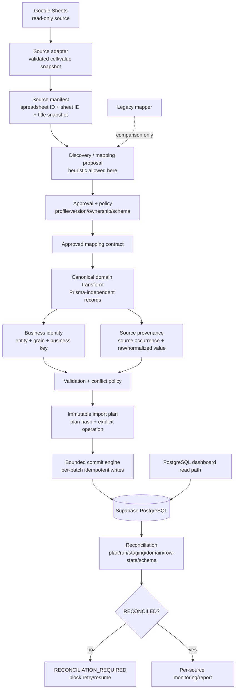

# Phase 1 — Implementation Blueprint

Design date: 2026-09-15
Design status: **PASS_WITH_REVIEW — blueprint approved as the Phase 2 implementation boundary**
Current automation readiness: **2/4 — controlled preflight/import only**
Target readiness after the first implementation increment: **3/4 — repeatable controlled production import**
Long-term target: **4/4 — unattended production sync only after automated recovery and monitoring pass**

This records the Phase 1 implementation plan and the controlled Phase 2 result. Phase 2 implements the pure contract seams described below without changing the Prisma schema, migrations, PostgreSQL/Supabase, Google Sheets, environment, API, cron, registry, or Agustus state. The requested `/docx` directory is absent; this file is stored in `energiprimer-next/docs`.

## Phase 2 implementation status

### CURRENT IMPLEMENTATION

The existing parser, compatibility import plan, writer, row-state engine, registry, and dashboard remain in place. No production cutover occurred.

### PHASE 2 IMPLEMENTATION

The planned module IDs are implemented under `src/services/google-sheets/canonical/`, with a one-way compatibility adapter from the current import plan. The bounded commit interface is repository-neutral and tested with an in-memory test double; the production writer is intentionally not rewired in a no-production-write phase. The production schema verifier was updated to current 31-model/21-FK history and compatibility classification.

### FUTURE WORK

Complete the application/use-case and reviewed repository integration, test it against a non-production database, close the coal provenance/schema bridge, and gather controlled repeatable import evidence before changing readiness from **2/4**.

## 1. Source evidence

| Evidence | Design input |
| --- | --- |
| `docs/GOOGLE_SHEETS_SOURCE_MAP.md` | Source ranges, semantic signals, variants, and parser risks |
| `docs/DATA_FLOW_MAP.md` | Current end-to-end architecture and mutation boundaries |
| `docs/DATABASE_MAPPING.md` | Current 31-model production schema, database targets, keys, and compatibility limitations |
| `docs/AUTOMATION_COMPLEXITY_AUDIT.md` | Top ten hotspots, complexity scores, and keep/refactor findings |
| `docs/RECONSTRUCTION_RECOMMENDATION.md` | Phase 0 decision to partially reconstruct, not rewrite |
| `src/services/google-sheets/import/types.ts:1-125` | Current typed records and plan shape |
| `src/services/google-sheets/import/plan.ts:326-752` | Current mapping/validation/plan construction |
| `src/services/google-sheets/import/commit.ts:138-303` | Current commit/checksum/transaction behavior |
| `src/services/google-sheets/sync/engine.ts:112-168,377-621,624-995` | Current row-state/orchestration boundaries |
| `prisma/production/schema.prisma:1-542` and `prisma/production/migrations` | Current production schema/history |
| `scripts/verify-supabase-production-runtime.ts` and `scripts/verify-agustus-production-state.ts` | Read-only runtime/state evidence |

### 1.1 Problem statement

Phase 0 found a working ingestion/dashboard foundation with boundary defects: dual mapping authority, incomplete provenance, source-independent business hashes without ownership policy, oversized/partly separate transaction state, and a stale current-schema verifier. The implementation blueprint must address those seams without replacing the working application.

## 2. Capability map and dependency order

These stable module IDs define the future work boundaries. They are design identifiers, not a new task tracker.

| Module ID | Responsibility | Depends on |
| --- | --- | --- |
| `source-manifest` | Immutable source/sheet identity, mutable observation metadata, ownership | Existing registry/discovery |
| `mapping-contract` | Versioned approved semantic/physical field mappings | `source-manifest` |
| `canonical-transform` | Prisma-independent domain records and validation envelope | `mapping-contract` |
| `identity-provenance` | Business key, source occurrence, content hash, complete traceability | `canonical-transform`, `source-manifest` |
| `import-sync` | Immutable plan, explicit operations, sync lifecycle | `canonical-transform`, `identity-provenance` |
| `transaction-recovery` | Bounded commit batches, unknown outcomes, resume rules | `import-sync` |
| `reconciliation-verifier` | Post-write evidence and current schema/provider comparison | `transaction-recovery`, `identity-provenance` |
| `legacy-deprecation` | Retire duplicate writable paths after cutover | All preceding modules |

Build order:

```text
source-manifest → mapping-contract → canonical-transform
       → identity-provenance → import-sync → transaction-recovery
       → reconciliation-verifier → legacy-deprecation
```

No cycle is allowed. The commit engine depends on an approved plan; the plan never depends on the commit engine to discover meaning.

## 3. Target architecture



The diagram keeps the current read-only adapter, registry, canonical July policy, normalized database, and dashboard. It changes the authority boundary: heuristic discovery proposes; only approved mapping contracts produce writable canonical records.

## 4. Preserve/change/remove/rebuild matrix

| Component | KEEP | EXTEND | REFACTOR | DEPRECATE | REBUILD | Decision/evidence |
| --- | ---: | ---: | ---: | ---: | ---: | --- |
| Google Sheets client | ✓ |  |  |  |  | Keep read-only OAuth, metadata/value API, validation, timeout, and safe errors (`src/lib/google-sheets.ts`) |
| Discovery | ✓ | ✓ |  |  |  | Keep metadata discovery; project immutable IDs/period/ownership into source manifest (`sync/discovery.ts`) |
| Registry |  | ✓ |  |  |  | Existing tables are valuable but need separate mapping approval/ownership/version semantics |
| Dynamic parser | ✓ |  | ✓ |  |  | Keep as analyzer; writable resolution must require approved paths (`dynamic/value-resolver.ts`, `parser.ts`) |
| Legacy mapper |  |  | ✓ | ✓ later |  | Make comparison/audit-only because it duplicates mapping policy (`legacy-mapping/mapper.ts`) |
| Import plan | ✓ | ✓ |  |  |  | Keep validation gates; add immutable plan hash, canonical envelope, provenance, and operation |
| Bulk upserts | ✓ | ✓ |  |  |  | Keep fixed batch SQL; add measured budgets and complete target provenance |
| Row-state |  |  | ✓ |  |  | Bulk persistence and reconcile separately from business commit (`engine.ts:112-168`) |
| Import commit |  | ✓ | ✓ |  |  | Consume plan only; split bounded transactions (`import/commit.ts`) |
| Prisma schema | ✓ | ✓ if approved |  |  |  | Current 31-model schema is useful; only additive changes after contract review |
| Legacy tables | ✓ |  |  | ✓ only after cutover |  | Keep compatibility consumers; do not delete/migrate in Phase 1 |
| Dashboard PostgreSQL | ✓ |  |  |  |  | Runtime verifier passed; preserve default read path |
| Production verifier |  |  | ✓ |  |  | Phase 2 replaces the hard-coded baseline with current-schema generation and compatibility classification |

No component is marked `REBUILD`. A non-KEEP action is deliberately limited to authority, provenance, transaction, or verification boundaries identified in Phase 0.

## 5. Implementation boundaries and remaining work

The following phases are ordered and separately reviewable. Files listed are confirmed likely touchpoints from current code; any new file path is marked as proposed and must be confirmed before implementation.

### Implementation A — Source and mapping contract (`source-manifest`, `mapping-contract`)

| Item | Design |
| --- | --- |
| Files likely affected | `src/services/google-sheets/dynamic/types.ts`; `sync/schema-detection.ts`; `sync/bb-policy.ts`; `sync/discovery.ts`; `import/plan.ts`; proposed `src/services/google-sheets/contract/*` |
| Database changes required | Possibly additive manifest/mapping approval/ownership/version fields or a separate manifest table; not required for the design artifact |
| Risk | Incorrectly treating a title or heuristic candidate as immutable/approved |
| Dependencies | Existing source registry and canonical July policy |
| Prerequisites | Human approval of source identity, ownership, version naming, and canonical field catalogue |
| Acceptance criteria | Sheet ID/workbook ID are immutable identity; title is a snapshot; every writable field has an approved mapping version; legacy physical fallback is profile-scoped |
| Rollback considerations | Keep current registry/parser read behavior; disable new approval projection without changing business rows |

### Implementation B — Canonical domain transform (`canonical-transform`)

| Item | Design |
| --- | --- |
| Files likely affected | `src/services/google-sheets/import/types.ts`; `import/plan.ts`; `import/normalizer.ts`; proposed Prisma-independent canonical module |
| Database changes required | None if the existing target fields can receive the canonical projection; provenance gaps may require additive schema/bridge work later |
| Risk | Changing null/empty behavior or decimal interpretation changes dashboard values |
| Dependencies | Approved mapping contract and fixture matrix |
| Prerequisites | Entity grain/field/unit/date contract reviewed |
| Acceptance criteria | Ten entities emit canonical records independent of Prisma; parser never calls persistence; valid empty, malformed, ambiguous, and fallback states remain distinct |
| Rollback considerations | Keep current import-plan adapter behind a compatibility boundary until canonical fixtures match |

### Implementation C — Identity and provenance (`identity-provenance`)

| Item | Design |
| --- | --- |
| Files likely affected | `src/services/google-sheets/sync/identity.ts`; `sync/change-detection.ts`; `import/types.ts`; `import/plan.ts`; `import/commit.ts`; `import/bulk-upserts.ts`; `sync/post-write-verification.ts` |
| Database changes required | Likely provenance/version/source-ownership fields and a bridge for `coal_consumption`/`coal_stock`; possibly an observation table |
| Risk | Altering unique/upsert behavior can duplicate or overwrite legacy data |
| Dependencies | Source manifest and canonical records |
| Prerequisites | Source ownership policy and legacy table decision |
| Acceptance criteria | Business key is source-independent; source occurrence is separately retained; raw display value is preserved; same-source update and cross-source conflict tests pass |
| Rollback considerations | Additive provenance is reversible; do not change existing unique constraints without a separately approved migration/expand-contract plan |

### Implementation D — Import and bounded commit (`import-sync`)

| Item | Design |
| --- | --- |
| Files likely affected | `src/services/google-sheets/import/commit.ts`; `bulk-upserts.ts`; `import/types.ts`; `sync/engine.ts`; `sync/lease.ts`; proposed repository/plan modules |
| Database changes required | Plan/approval/batch checkpoint or equivalent durable artifact may be required |
| Risk | Partial batches, duplicate retries, and P2028 unknown outcomes |
| Dependencies | Canonical plan, identity/provenance, transaction design |
| Prerequisites | Current pooler performance budget and disposable failure fixtures |
| Acceptance criteria | Commit consumes an approved immutable plan only; fixed batches have measured limits; explicit INSERT/UPDATE/SKIP/BLOCK operations are honored; no source read occurs inside transaction |
| Rollback considerations | Preserve existing bulk upserts behind an adapter; a failed new writer must not run concurrently against the same source scope |

### Implementation E — Recovery and reconciliation (`transaction-recovery`, `reconciliation-verifier`)

| Item | Design |
| --- | --- |
| Files likely affected | `src/services/google-sheets/sync/post-write-verification.ts`; `sync/engine.ts`; `sync/monitoring.ts`; `sync/retry.ts`; proposed recovery/reconciliation modules |
| Database changes required | Optional reconciliation result/batch state; no destructive cleanup |
| Risk | Declaring an unknown transaction outcome successful or retrying it blindly |
| Dependencies | Plan hash, batch identity, provenance, target business keys |
| Prerequisites | Transaction A/B/C contract and table-level reconciliation queries |
| Acceptance criteria | Unknown/partial states become `RECONCILIATION_REQUIRED`; missing batches can resume only under the same plan; successful runs become `RECONCILED` only after all required checks |
| Rollback considerations | Reconciliation is read-only first; state advancement can be retried without rewriting business rows |

### Implementation F — Current production verification (`reconciliation-verifier`)

| Item | Design |
| --- | --- |
| Files likely affected | `scripts/verify-supabase-production-schema.mjs`; `src/services/google-sheets/sync/production-target.ts`; new read-only verifier helpers if required |
| Database changes required | None |
| Risk | False drift alarms or accepting unexpected objects by weakening checks |
| Dependencies | Current production Prisma schema/history and compatibility classification |
| Prerequisites | Confirm exact selected production history and provider object scope |
| Acceptance criteria | Expected objects derive from `prisma/production/schema.prisma`; current 31-model inventory is handled; compatibility versus unexpected objects are separately reported; writes remain zero |
| Rollback considerations | Retain old verifier as historical reference, but label it stale; do not use it to authorize migration/data repair |

### Implementation G — Legacy deprecation (`legacy-deprecation`)

| Item | Design |
| --- | --- |
| Files likely affected | `src/services/google-sheets/legacy-mapping/*`; `scripts/import-google-sheets.ts`; `scripts/run-google-sheets-sync.ts`; direct Google dashboard fallback; related docs |
| Database changes required | None by default; table retirement is a separate deprecation/migration project |
| Risk | Breaking historical imports, reports, routes, or operator workflows that still depend on legacy tables |
| Dependencies | All prior phases plus two or more successful controlled cutovers |
| Prerequisites | Plan equivalence fixtures, production reconciliation, consumer inventory |
| Acceptance criteria | Legacy code is comparison/read-only or explicitly retired; no second writable mapping authority remains; compatibility consumers are proven migrated |
| Rollback considerations | Preserve legacy readers and restore prior writer only through an explicit source-scope rollback; never delete tables as part of this phase |

## 6. Fixture and test design

Phase 2 fixture execution is implemented in `scripts/fixtures/phase2-canonical-fixtures.ts` and `scripts/verify-phase2-canonical-contract.ts`. It validates the canonical plan/commit/reconciliation boundary with an in-memory repository; it is not a production import.

| Category | Cases | Expected contract result |
| --- | --- | --- |
| Canonical layout | `Juli26-BB`-like semantic layout | Approved mapping; deterministic plan |
| Legacy layout | Reviewed `Januari26-BB`–`Juni26-BB` physical layout | Comparison/approved legacy profile only; no generalized coordinate |
| Reordered columns | Unit/resource columns moved | Same business keys and values if approved semantic paths resolve; no duplicate |
| Duplicate labels | Duplicate Unit 2 or HOP labels | Approved path required; otherwise BLOCK, never silent physical guess |
| Missing/renamed headers | Missing semantic path or renamed field | BLOCK/SCHEMA_REVIEW |
| Extra columns | Unused source columns | Ignore only if schema contract permits; otherwise schema review |
| Numeric | `1250.50`, `1,250.50`, `1.250,50`, `1250,50` | Explicit locale policy; normalized value and raw text both retained |
| Numeric ambiguity | `1.250`, `1,250` | Required locale/profile decision or BLOCK; no universal guess |
| Numeric edge | percentage, zero, negative, empty, `N/A` | Unit-aware validation; zero valid; negative/empty policy explicit |
| Dates | ISO, Indonesian slash, dash, day-only, two-digit year | Canonical UTC date or explicit rejection; wrong month/invalid date blocks |
| Mapping confidence | high confidence, low confidence, competing candidates | Only approved path writes; low/ambiguous candidates BLOCK |
| Supplier | Seven canonical suppliers, alias, unknown pattern supplier | Canonical seven-set passes; unknown supplier review/blocks import |
| Identity | same key, changed value, moved row, duplicate rows, second source | SKIP/UPDATE; duplicate/cross-source conflict BLOCK |
| Recovery | before commit, during commit, after business commit, missing row state, crash | FAILED or RECONCILIATION_REQUIRED; no blind full retry |
| Target fallback | explicit target versus policy `70,020` | Explicit source labeled source-observed; fallback labeled policy-approved |
| Agustus isolation | 352 valid parsed candidates, registry ERROR | BLOCKED admission, no approved plan/write |

## 7. Readiness matrix

| Requirement | Level 2 — current | Level 3 — repeatable production import | Level 4 — unattended sync |
| --- | --- | --- | --- |
| Deterministic mapping | Partial; parser/policy gates exist | Required; approved versioned paths | Required and monitored |
| Complete provenance | Partial; normalized fields uneven | Required for every committed observation or declared compatibility bridge | Required and queryable automatically |
| Deterministic identity | Partial; business-like hash exists | Required; source ownership conflicts explicit | Required across all sources |
| Reconciliation | Manual/read-only evidence | Required after each controlled run | Automated and alerting |
| Recovery | Manual operator decision | Required with resumable bounded batches | Automated with safe escalation |
| Registry health | Manual review | Required before write | Monitored per source/worksheet |
| Production target verification | Required | Required | Required |
| Human approval | Required | Controlled approval | Policy-dependent, with audit evidence |
| Current schema verification | Phase 2 current-model read-only verifier passes | Keep in release gate | Current-model verifier in release gate |
| Delete/retraction behavior | No automatic delete | Explicit flag/reconciliation | Automated only under approved business policy |

The target after Implementation A–F is Level 3, not automatically Level 4. Level 4 requires operational evidence over time, alerting, source ownership, recovery automation, and an approved policy for all remaining fallbacks.

## 8. Validation plan for future implementation

| Validation | Phase 1 status | Future gate |
| --- | --- | --- |
| Static inspection | PASS in Phase 0 | Repeat after each boundary change |
| Lint | PASS in Phase 0 | `npm.cmd run lint` |
| TypeScript | PASS in Phase 0 | `node_modules\\.bin\\tsc.cmd --noEmit` |
| Build | PASS in Phase 0 | `npm.cmd run build` |
| Prisma schema | PASS in Phase 0 for local/production schema | Validate selected schema/history |
| Read-only Supabase runtime | PASS in Phase 0 | Repeat before/after controlled cutover |
| Read-only Agustus state | PASS: zero rows/duplicates/staging/row states | Do not rerun as a write; use as isolation evidence |
| Fixture execution | PASS in Phase 2; local contract/in-memory only | Repeat against a reviewed test database |
| Transaction failure simulation | PASS in Phase 2; known/unknown outcome doubles | Required before any production cutover |
| Browser/e2e sync | NOT VERIFIED | Required only for an authorized implementation/cutover |

## 9. Current state versus target state

### Current state

- The active application and dashboard PostgreSQL path are healthy in read-only runtime verification.
- The dynamic parser, canonical July policy, plan gates, bulk upserts, target verification, and registry/lease foundations exist.
- Agustus parses validly but is blocked by registry `ERROR`/schema-review state; no write is authorized.
- The compatibility writer still has incomplete target provenance for coal, date/stock policy boundaries, and separate row-state persistence; the structural verifier is now current-model based.

### Target state

- One approved versioned mapping authority.
- One Prisma-independent canonical domain transform.
- Separate business identity, source identity, source occurrence, and content hash.
- Immutable plan with explicit operations.
- Bounded, observable, idempotent transactions.
- Reconciliation as a required lifecycle state.
- Current-model production verifier with compatibility classification.

### Future work after Phase 2

The Phase 2 pure boundaries are implemented, but the repository/use-case integration, coal provenance bridge, controlled test-database run, and production cutover remain separately authorized work. This document does not authorize data repair, registry reconciliation, or import execution.

## 10. Decision and rationale

Proceed with a partial, sequential reconstruction. Preserve working foundations and change only the seams that prevent deterministic interpretation, complete provenance, bounded recovery, and trustworthy verification. Avoid a full rebuild because Phase 0 demonstrated working runtime data, schema targets, policy gates, and dashboard reads; the evidence identifies boundary defects rather than a failed end-to-end architecture.

## 11. Not verified

- No production canonical import has been executed.
- The Phase 2 commit boundary has only been exercised with an in-memory repository, not a test or production database.
- Full target-table provenance/reconciliation for coal compatibility tables remains unavailable without a schema bridge.
- RLS/policies, Data API privileges, and project-level source ownership remain unknown.
- Agustus production write eligibility is **NOT VERIFIED — PRODUCTION WRITE NOT AUTHORIZED**.

## 12. Future work boundary

Production integration remains prohibited without a separately scoped approval. Database changes, migrations, source edits, API/cron changes, registry repair, and production import belong to later tasks. The existing `tasks/plan.md` and `tasks/todo.md` are a separate completed local-ingestion plan and were not overwritten.

## 13. Acceptance criteria for the design

- [ ] Capability IDs and dependency order are explicit.
- [ ] Preserve/change/remove/rebuild decisions are recorded with evidence.
- [ ] Future work is separated into implementation boundaries A–G with files, database impact, risk, dependency, prerequisite, acceptance, and rollback considerations.
- [ ] Fixture matrix covers layout, numeric, date, mapping, identity, supplier, target, and recovery cases.
- [ ] Level 2/3/4 readiness gates are explicit.
- [ ] Target architecture keeps discovery separate from approved mapping and persistence.
- [ ] No implementation, migration, registry repair, or production write is implied by this document.

## 14. Open questions

1. Should the immutable plan be a PostgreSQL record, durable object, or both?
2. What exact role/actor can approve a mapping, source owner, policy fallback, or recovery decision?
3. What measured transaction budget and batch size are acceptable through the Supabase pooler?
4. Which legacy consumers must remain online before compatibility tables can be deprecated?
5. What business policy, if any, will authorize source deletion/retraction handling?
